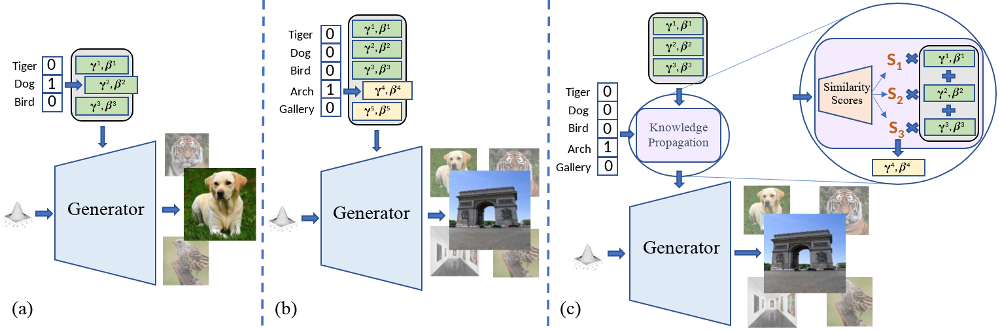
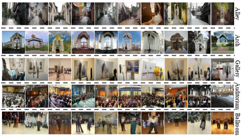

# Efficient Conditional GAN Transfer with Knowledge Propagation across Classes

### Accepted to CVPR 2021

Authors: [Mohamad Shahbazi](https://people.ee.ethz.ch/~mshahbazi/), [Zhiwu Huang](https://zhiwu-huang.github.io/), [Danda P.Paudel](https://people.ee.ethz.ch/~paudeld/), [Ajad Chhatkuli](https://scholar.google.ch/citations?hl=en&user=3BHMHU4AAAAJ), and [Luc Van Gool](https://scholar.google.ch/citations?hl=en&user=TwMib_QAAAAJ)
<br> Paper: https://arxiv.org/pdf/2102.06696.pdf




## Abstract
Generative adversarial networks (GANs) have shown impressive results in both unconditional and conditional image generation. In recent literature, it is shown that pre-trained GANs, on a different dataset, can be transferred to improve the image generation from a small target data. The same, however, has not been well-studied in the case of conditional GANs (cGANs), which provides new opportunities for knowledge transfer compared to unconditional setup. In particular, the new classes may borrow knowledge from the related old classes, or share knowledge among themselves to improve the training. This motivates us to study the problem of efficient conditional GAN transfer with knowledge propagation across classes. To address this problem, we introduce a new GAN transfer method to explicitly propagate the knowledge from the old classes to the new classes. The key idea is to enforce the popularly used conditional batch normalization (BN) to learn the class-specific information of the new classes from that of the old classes, with implicit knowledge sharing among the new ones. This allows for an efficient knowledge propagation from the old classes to the new classes, with the BN parameters increasing linearly with the number of new classes. The extensive evaluation demonstrates the clear superiority of the proposed method over state-of-the-art competitors for efficient conditional GAN transfer tasks. 
The code will be available here soon.

## Overview
1. [Installation & Dependencies](#Dependencies)
2. [Prepration](#Prepration)
    1. [Directories](#Directories)
    2. [Data](#Data)
    3. [Pretrained Weights](#Weights)
3. [Training](#Training)
    1. [Launch the Training](#launch)
    2. [Important Training Parameters](#params)
    3. [Training Stages](#stage)
5. [Evaluation](#Evaluation)
    1. [Metrics](#Metrics)
    2. [Final Evaluation](#Final)
6. [Results](#Results)
7. [Contact](#Contact)
8. [How to Cite](#How-to-Cite)

## 1. Installation & Dependencies<a name="Dependencies"></a>
The code has been tested with Python 3.6 and Pytorch 1.0.1.


To install the dependencies:
```bash
pip install -r requirements.txt
```

## 2. Prepration<a name="Prepration"></a>

### 2.1. Directories<a name="Directories"></a>
The base directory--which can be different from the code directory--will contain the following sub-directories:
| Path | Description
| :--- | :----------
| base_dir | The base directory containing your data, weights, logs, and generated samples
| &ensp;&ensp;&boxvr;&nbsp; data | Contains the training data
| &ensp;&ensp;&boxvr;&nbsp; weights | Contains the pretraining and training weights
| &ensp;&ensp;&boxvr;&nbsp; logs | Contains the training logs
| &ensp;&ensp;&boxur;&nbsp; samples | Contains the saved images during evaluation

Before training, you should create the sub-directories <b>"data"</b> and <b>"weights"</b>. Then place the data and pretraining weights inside them accordingly. the sub-directories <b>"logs"</b> and <b>"samples"</b> will be created automatically during the training.

### 2.2. Data<a name="Data"></a>
Data prepration is done based on the setup you are using. The code is adapted to two setups:
<ol>
    <li><b>ImageNet</b>: Using BigGAN pretrained on ImageNet (Image size 128x128)</li>
    <li><b>CIFAR</b>: Using BigGAN pretrained on CIFAR (Image size 32x32)</li>
</ol>    

The multi-class data should be organized as a main folder called "ImageNet" for ImageNet setup or "cifar" for CIFAR setup. (regardless of the actual target data). The main folder should contain different sub-folders for different classes of the target data. The main folder then should be placed in "base_dir/data/"
```bash
base_dir/data/ImageNet/[class_1, ..., class_n]
```
```bash
base_dir/data/cifar/[class_1, ..., class_n]
```
Below you can find the datasets used in our experiments:
<ul>
    <li><a href="http://data.csail.mit.edu/places/places365/train_large_places365standard.tar">Places356</a>: 5 classes (Alley, Arch, Art Gallery, Auditorium,
Ballroom) are selected and down-sampled to 500 images per class</li>
    <li><a href="https://vcla.stat.ucla.edu/people/zhangzhang-si/HiT/exp5.html">Animal Face</a>: The class "Natural" is excluded in our experiments.</li>
    <li><a href="https://github.com/knjcode/cifar2png">CIFAR100</a></li>
</ul>

Then, to pre-calulate the inception momentums of the target dataset for FID calculation:

```bash
bash  prepare_data
```

Note 1: The path to the main folder of the dataset should be modified in the data prepration scripts using "--data_root".
Note2: For other setups other than ImageNet and CIFAR, you need to adapt the data-specific configuraion (type of the data loader, image size, root folder name, ...)


### 2.3. Pretrained Weights<a name="Weights"></a>

Before training, BigGAN's pretrained weights should be placed in the sub-directory "weights" of the base directory.

For BigGAN on ImageNet, you can use the [pretrained weights](https://github.com/ajbrock/BigGAN-PyTorch#pretrained-models) provided by the BigGAN's authors. In this project, we have used the [main checkpoint](https://drive.google.com/file/d/1nAle7FCVFZdix2--ks0r5JBkFnKw8ctW/view).

If you want to use other datasets (e.g. CIFAR10/100) as the pretraining dataset, you can first train the [BigGAN](https://github.com/ajbrock/BigGAN-PyTorch) on the desired dataset, and then, use the pretrained weights for cGANTransfer.

## 3. Training<a name="Training"></a>
### 3.1. Launch the Training<a name="launch"></a>
To launch the training on your target data:

```bash
bash train.sh
```

In the experimetns conducted in the paper, for the ImageNet backbone, we trained the model with the batch size of 256 using 8 V100 (16G) GPUs. For the CIFAR experiments, the model is trained with the batch size of 50  using one V100 (16G) GPU.

### 3.2. Important Training Parameters<a name="params"></a>
Some of the configuraions in  scripts "train_ImageNet.sh" and "train_cifar.sh" need to be set according to your experiments. Some of the important parameters are:
| Parameter | Description
| :--- | :----------
| --base_dir | The base directory containing your data, weights, logs, and generated samples
| --experiment_name | The name of the experiment you are going to run (will be generated automatically if nothing is passed)
| --batch_size | The size of the training batch
| --stage | The stage of the training ["BN", "FT"] (Details in Sec. 3.3 of this README file).
| --n_class | The number of target classes
| --n_pretrain_class | The number of pretrained classes
| --resume | If used, weights are loaded from the last checkpoint. Otherwise, pretrained weights are loaded
| --load_weights | The suffix of the checkpoint, in case of loading a specific checkpoint
| --res_l2_scale | The degrees of l2 regularization (details in section 4.3 of the paper)
| --comb_l1_scale | The degrees of l1 regularization (details in section 4.3 of the paper)

Make sure to understand the configuration used in the scripts and their default values, by reading their descriptions in "utils.py"

### 3.3. Training Stages<a name="stage"></a>
The training is assumed to start from a pre-trained network, and can be done in two stages.

In the first stage (BN) , only the batch normalization (BN) parameters of the target classes are learned using transfering knowledge from pre-trained classes (see the paper for details). To train in this mode, set the value flag "--stage" to "BN" in the training script.

In addition to the first stage, an extra fine-tuning stage is also possible, in which the whole network (including the obtained BN prameters of the target data) is fine-tuned on target dataset. To enable fine-tuning, do the following steps:
<ul>
    <li>Set the value flag "--stage" to "FT" in the training script</li>
    <li>Use the value flag "--resume" in the training script</li>
    <li>Specify the suffix of the checkpoints for fine-tuning using "--load_weights" (E.g. "best1" for state_dict_best1.pth)</li>
</ul>

Note: To use the best model best on the evaluation saved during the training, pass the value "best#i" to the flag "--load_weights". #i is the number the saved best model.


## 4. Evaluation<a name="Evaluation"></a>

### 4.1. Evaluation Metrics<a name="Metrics"></a>
The main evaluation metrics used in this project are Frechet Inception Distance (FID) and Kernel Maximum Mean Discrepancy (KMMD). Inception score (IS) is also included in the code.

FID and IS are calculated during the training using the Pytorch implementation provided by [BigGAN](https://github.com/ajbrock/BigGAN-PyTorch).

For KMMD, the default implementation provided by [GAN Metrics](https://github.com/xuqiantong/GAN-Metrics) is used (Gaussian kernel with sigma=1).

KMMD calculation is deactivated by default to avoid memory errors. To activate the KMMD calculation, use the flag "--kmmd" in the script and reduce the number of generated samples used for evaluation using "----num_inception_images" (default=50000. We were able to avoid memory errors by setting it to 25000). 

<b>Note 1</b>: Reducing the number of generated samples might make the FID calculation a bit less accurate.

<b>Note 2</b>: For very small datasets, FID score becomes unstable, since the inception statistics  of the real data cannot be estimated accurately.

### 4.2. Final Evaluation<a name="Final"></a>
In addition to the evaluation during the training, you can evaluate your final model using the following commands:
```bash
bash sample.sh
```
Make sure to adjust the configuration in sample_ImageNet.sh / sample_cifar.sh according to your experiments.

## 5. Results<a name="Results"></a>
Generated images from 5 classes of Places365 only by learning the BN parameters:




## 6. Contact<a name="Contact"></a>
For any questions, suggestions, or issues with the code, please contact Mohamad at <a>mshahbazi@vision.ee.ethz.ch</a>.

## 7. How to Cite<a name="How-to-Cite"></a>
If you find this project helpful, please consider citing us as follows:
```bash
@inproceedings{shahbazi2021cGANTransfer,
      title = {Efficient Conditional GAN Transfer with Knowledge Propagation across Classes},
      author    = {Shahbazi, Mohamad and
                   Huang, Zhiwu and
                   Paudel, ‪Danda Pani and
                   Chhatkuli, Ajad and
                   Van Gool, Luc},
      year = {2021},
      booktitle = {2021 {IEEE} Conference on Computer Vision and Pattern Recognition, {CVPR} 2021}
}
```


